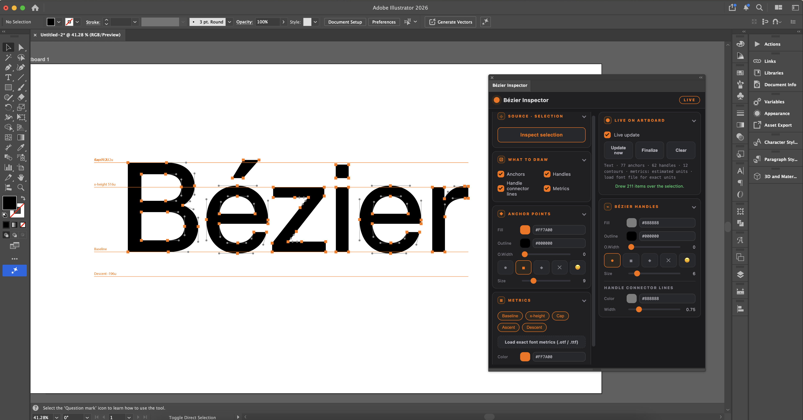

# Bézier Inspector for Adobe Illustrator

### 🎨 Adobe Illustrator CEP Extension / Adobe Illustrator CEP 플러그인

Visualize anchor points, Bézier handles, connector lines, and typography metrics directly on the Illustrator artboard. / 앵커 포인트, 베지어 핸들, 연결선, 그리고 타이포그래피 메트릭을 Illustrator 아트보드 위에서 실시간으로 시각화하는 CEP 플러그인입니다.



## ✨ Features

🔶 Anchor Points / 앵커 포인트 시각화

🌀 Bézier Handles / 베지어 핸들 시각화

➖ Handle Connector Lines / 핸들 연결선 표시

📏 Baseline, x-height, Cap Height, Ascender, and Descender Metrics / Baseline, x-height, Cap Height, Ascender, Descender 표시

🎛 Adjustable Colors, Line Widths, Marker Sizes, and Metric Caption Sizes / 색상, 선 두께, 포인트 크기 및 메트릭 캡션 크기 조절

🗂 Editable Illustrator Groups for Metrics, Anchors, Handles, and Connector Lines / 메트릭, 앵커, 핸들, 연결선을 각각 독립된 Illustrator 그룹으로 생성

## 📦 Installation

Copy the `com.ju.bezierinspector` folder to the CEP extensions directory. / `com.ju.bezierinspector` 폴더를 CEP extensions 폴더에 복사하세요.

**macOS**

```txt
~/Library/Application Support/Adobe/CEP/extensions/
```

**Windows**

```txt
%APPDATA%/Adobe/CEP/extensions/
```

Restart Adobe Illustrator and open `Window → Extensions → Bézier Inspector`. / Illustrator를 재실행한 후 `Window → Extensions → Bézier Inspector`에서 실행하세요.

## 🎥 Demo

See the demo video and screenshots included in this repository. / 저장소에 포함된 영상과 스크린샷에서 실제 사용 예시를 확인할 수 있습니다.

## 🛠 Recommended For

Type Designers · Lettering Artists · Brand Designers · Logo Designers · Illustrator Power Users

타입 디자이너 · 레터링 디자이너 · 브랜드 디자이너 · 로고 디자이너 · Illustrator 고급 사용자

## 📄 License

MIT License
